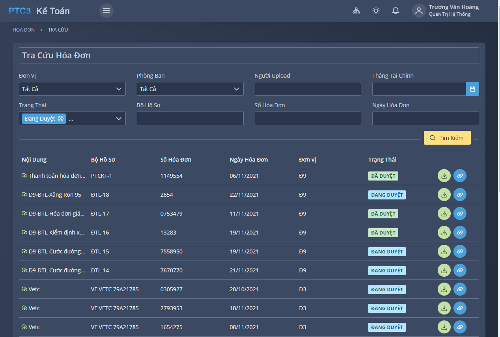

# Lưu Trữ Hóa Đơn Chứng Từ

Phần mềm lưu trữ hóa đơn chứng từ PTC3 - **[https://portal.ptc3.npt.com.vn/app/ketoan](https://portal.ptc3.npt.com.vn/app/ketoan)**

## Đăng nhập tài khoản

Liên hệ phòng VNCNTT để được cấp tài khoản

## Chức Năng

## Cách tra cứu file hóa đơn XML

1. Tìm kiếm trong nội file hóa đơn PDF: đường dẫn tra cứu và mã tra cứu hóa đơn
2. Mở trang web tra cứu và dùng mã tra cứu để tìm hóa đơn
3. Kiểm tra số hóa đơn, ngày hóa đơn xem đã chính xác chưa
4. Tải file XML về máy tính
5. Thực hiện Upload cả 2 file lên phần mềm lưu trữ
